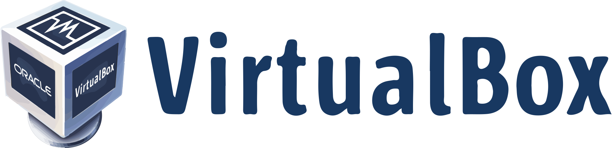

## Projetos DevOps - VM's

## Links Úteis

[Site da Dio](https://dio.me/)

[Sintaxe Básica Markdown](https://www.markdownguide.org/basic-syntax/)

[Download do git](https://git-scm.com/downloads)

[Download VirtualBox](https://www.virtualbox.org/wiki/Downloads)

## Tecnologias utilizadas nos projetos

    

- 
  ## Desafio:

